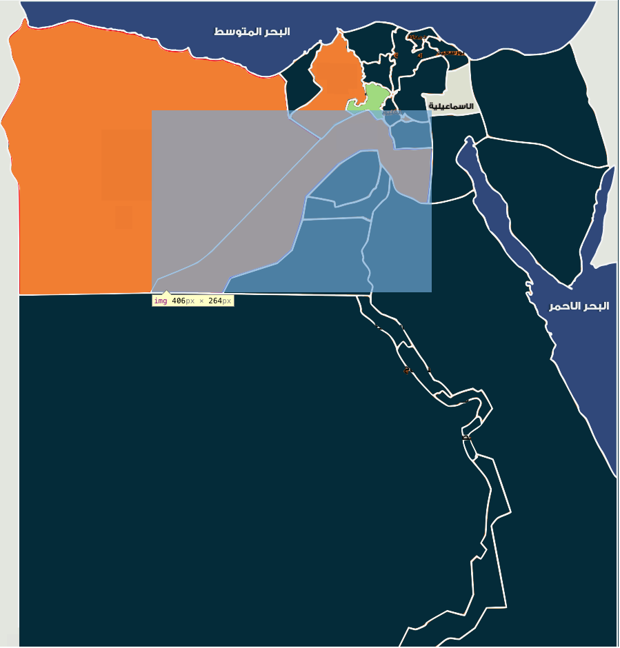

#	SelectPolygon
----

+	[SelectPolygon.js](js/SelectPolygon.js) file
+	Online example: [yogash1290.appspot.com/SelectPolygon/](http://yogash1290.appspot.com/SelectPolygon/index.html)
+	download [example](https://github.com/yoga1290/SelectPolygonJS/blob/master/example.zip)

----
##	Motivation:
----

I was working making a selectable map of Egypt where people can select their city.
You can't treat cities as seperate images and assign onClick handler per each, as images overlaps:


-----


##	Usage:
----

+	Import the [SelectPolygon.js](js/SelectPolygon.js) in the HTML header:

```html
	<script src="SelectPolygon.js"></script>
```


-----
+	Add a canvas to your page with an **id** , **width**, **height** attributes:

```html
	<canvas id="MapOfEgypt" width="1000" height="1000"></canvas>
```

-----
+	Make an array of object, with **src**, **x** and **y** hooks indicating the image source URL and XY position to be drawn in the canvas:

```javascript
	var imgArray=[
				{src:'matroh.png',x:2,y:23},//0
				{src:'giza.png',x:223,y:159},//1
				{src:'bhera.png',x:424,y:45},//2
				{src:'sinai.png',x:691,y:198},//3
				{src:'nsinai.png',x:683,y:61},//4
				{src:'redsea.png',x:528,y:260},//5
				{src:'alexandria.png',x:409,y:62},//6
				{src:'sahra.png',x:30,y:423},//7
				{src:'menia.png',x:327,y:315},
				{src:'kafrelshiekh.png',x:499,y:30},
				{src:'banys.png',x:442,y:242},
				{src:'fayoum.png',x:450,y:219},
				{src:'cairo.png',x:568,y:173},
				{src:'swees.png',x:625,y:162},
				{src:'aswan.png',x:578,y:660},
				{src:'arbia.png',x:528,y:76},
				{src:'asyot.png',x:520,y:427},
				{src:'sohag.png',x:579,y:494},
				{src:'da2hlia.png',x:568,y:39},
				{src:'shar2ya.png',x:572,y:81},
				{src:'portsaid.png',x:620,y:53},
				{src:'monfiya.png',x:503,y:118},
				{src:'qalubia.png',x:557,y:140},
				{src:'domiat.png',x:592,y:38},
				{src:'isma3lia.png',x:615,y:92},
				{src:'lxr.png',x:672,y:602},
				{src:'quna.png',x:632,y:563}
		];
```

-----
+	call the SelectPolygon passing your **Canvas Id**, **imgArray**.
+	optionally, you can set any of **onclick**,**ondblclick**,**onmousedown**,**onmousemove**,**onmouseover**,**onmouseout** and/or **onmouseup** passing a callback functions as the parameter.
+	**event** object and the **selectedIndex** of the **imgArray** will be passed as parameters to the callback functions

```javascript

	SelectPolygon("MapOfEgypt",imgArray)
		.onmousedown(function(event,selectedIndex){
			// ...
		})
		.onmousemove(function(event,selectedIndex){
			// ...
		})
		.onmouseup(function(event,selectedIndex){
			// ...
		});

```